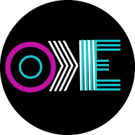

- [Overview](#overview)
- [User stories](#user-stories)
- [UX](#ux)
    - [Strategy](#strategy)
    - [Scope](#scope)
    - [Structure](#structure)
    - [Skeleton](#skeleton)
- [Technologies used](#technologies-used)
- [Code validity](#code-validity)
- [Version Control](#version-control)
- [Deployment](#deployment)
- [Credits](#credits)

## **Ewa Kukla Portfolio**

## Demo
---

## Overview
---

## User Stories
---
## External Users Stories
1. As a new user, I want to easily understand the purpose of this site.
2. As a visitor, I want to be able to access the website on a desktop or mobile device, so that I won't be restricted from which device I can access the site. 
3. As a potential recruiter, I want to be able to connect with the owner of the website on LinkedIn, GitHub, social media so that I can find more information about their work experience and be able to see their projects.
4. As a potential recruiter, customer I want to be able to contact the website owner, so that I will be able to share my feedback regarding the website, ask any questions or recommendations that I may have.
5.  As a potential recruiter I want to be able download their CV, so I will be able see their history work timelines

## Site Owner stories
6. As a site owner, I want to be able showcase my portfolio of projects to potential recruiter, employee future customers 

## UX (5 planes)
---

## **1. Strategy Plane**
My goal for this project is to create my portfolio website with all my recent projects

## **2. Scope Plane**

## **3. Structure Plane**

## **4. Skeleton Plane**
## Wireframe mockups:
- [home page (home.html)](wireframes/home-page.png)

- [about page](wireframes/about-pages.png)

- [projects page](wireframes/projects-page.png)

- [contact page](wireframes/contact-page.png)

## **5. Surface Plane**

**Colors**

**Typography**

 **Images**

## Technologies Used
**1. Languages**
-	HTML5
-	CSS3 
-	Python
-	JavaScript for interaction

**2. Integrations**
-	Flask- The project uses the Flask micro-web framework and links with jinja to create the webpages.
-	Jinja -  The project uses the Jinja templating engine.
-   SaaS - 
-	Fontawesome - Font Awesome was the source of all icons.
-	Googlefonts - Fonts used on the website courtesy of Google Fonts.

**4. Version Control, Storage and Hosting**

**5. Editors**
- XD Adobe Wireframing design tool to create wireframes

---

## Code Validity

## Version Control

## Deployment

## Credits
